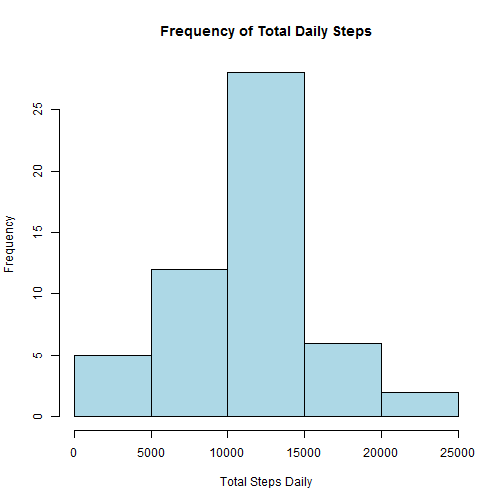
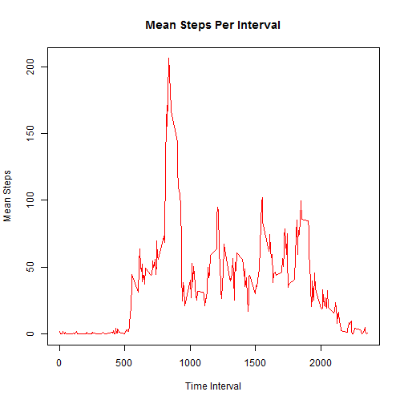
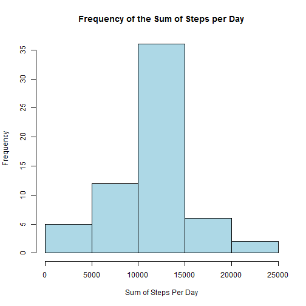

## Loading and preprocessing the data  
1. Show any code that is needed to  
2. Load the data (i.e. read.csv())  
3. Process/transform the data (if necessary) into a format suitable for your analysis  


```r
# Please unzip your activity.csv file into this same directory 
data <- read.csv("activity.csv", header=TRUE)
data$date <- as.Date(data$date)
```


## What is mean total number of steps taken per day?  
1. For this part of the assignment, you can ignore the missing values in the dataset.  
2. Calculate the total number of steps taken per day  
3. If you do not understand the difference between a histogram and a barplot, research the difference between them. Make a histogram of the total number of steps taken each day  
4. Calculate and report the mean and median of the total number of steps taken per day  


```r
#Calculate the total number of steps taken per day
agg.steps.sum <- aggregate(steps ~ date, data=data, sum, na.rm=TRUE)
hist(agg.steps.sum$steps, xlab="Total Steps Daily", main="Frequency of Total Daily Steps", col="light blue")
```

 

```r
#Calculate and report the mean and median of the total number of steps taken per day
mean.steps <- mean(agg.steps.sum$steps)
median.steps <- median(agg.steps.sum$steps)
```

The **mean** number of steps taken: 1.0766189 &times; 10<sup>4</sup>  
The **median** number of steps taken: 10765  


## What is the average daily activity pattern?  
1. Make a time series plot (i.e. `type = "l"`) of the 5-minute interval (x-axis) and the average number of steps taken, averaged across all days (y-axis)  
2. Which 5-minute interval, on average across all the days in the dataset, contains the maximum number of steps?  


```r
# tapply the number of steps per interval
mean.steps.interval <- tapply(data$steps, data$interval, mean, na.rm = TRUE)
# grab a vector of all the intervals
reduced.levels <- data[data$date=="2012-10-01",3]

#Make a time series plot (i.e. type = "l") of the 5-minute interval (x-axis) and the average number of steps 
# taken, averaged across all days (y-axis)
plot(reduced.levels,mean.steps.interval, type="l", xlab="Time Interval", ylab="Mean Steps", 
     main="Mean Steps Per Interval", col="red")
```

 

```r
#Which 5-minute interval, on average across all the days in the dataset, 
# contains the maximum number of steps?
# Create a df of the intervals and mean steps
mean.steps.df <- data.frame(reduced.levels, mean.steps.interval)
# name the variables
names(mean.steps.df) <- c("interval", "mean.steps")
# Find the interval where the most steps(mean), were taken
max.interval <- mean.steps.df[(mean.steps.df$mean.steps==max(mean.steps.df$mean.steps)),1]
```
  
The 5-minute interval that contains the maximum number of steps: 835  


## Inputing missing values  
1. Note that there are a number of days/intervals where there are missing values (coded as `NA`). The presence of missing days may introduce bias into some calculations or summaries of the data.  
2. Calculate and report the total number of missing values in the dataset (i.e. the total number of rows with `NAs`)  
3. Devise a strategy for filling in all of the missing values in the dataset. The strategy does not need to be sophisticated. For example, you could use the mean/median for that day, or the mean for that 5-minute interval, etc.  
4. Create a new dataset that is equal to the original dataset but with the missing data filled in.  
5. Make a histogram of the total number of steps taken each day and Calculate and report the mean and median total number of steps taken per day. Do these values differ from the estimates from the first part of the assignment? What is the impact of imputing missing data on the estimates of the total daily number of steps?  


```r
#Calculate and report the total number of missing values in the dataset 
# (i.e. the total number of rows with NAs for steps)
num.na <- sum(is.na(data$steps))
```
The total number of missing values is: 2304  

In order to replace any NA values in the steps variable, we will scan the column for NA values, and then replace them with the mean value that corresponds to that time interval.


```r
# We are going to replace the NA's with the mean value for that time interval and
# we will create a new dataset that is equal to the original dataset but with the missing 
# data filled in. We will Keep the same name. 
for (i in 1:length(data$steps)){
        if (is.na(data$steps[i])){
                data$steps[i] <- mean.steps.df[mean.steps.df$interval == data$interval[i],2]
        }
}


#Make a histogram of the total number of steps taken each day and 
#agg.steps.day <- aggregate(data$steps, data$date)
sum.steps.date <- tapply(data$steps, data$date, sum, na.rm = TRUE)
hist(sum.steps.date, col="light blue", xlab="Sum of Steps Per Day", 
     main="Frequency of the Sum of Steps per Day")
```

 

```r
# Calculate and report the mean and median total number of steps taken per day. 
mean.steps.day <- mean(sum.steps.date)
median.steps.day <- median(sum.steps.date)
```
 
The **mean** total number of steps per day is: 1.0766189 &times; 10<sup>4</sup>  
The **median** total number of steps per day is: 1.0766189 &times; 10<sup>4</sup>  
Q: Do these values differ from the estimates from the first part of the assignment?    
A: Yes!  
Q: What is the impact of imputing missing data on the estimates of the total daily number of steps?  
A: The impact is minimal, changing the median value from 10765 to 1.0766189 &times; 10<sup>4</sup>  


## Are there differences in activity patterns between weekdays and weekends?  
For this part the `weekdays()` function may be of some help here. Use the dataset with the filled-in missing values for this part.  
1. Create a new factor variable in the dataset with two levels - "weekday" and "weekend" indicating whether a given date is a weekday or weekend day.  
2. Make a panel plot containing a time series plot (i.e. type = "l") of the 5-minute interval (x-axis) and the average number of steps taken, averaged across all weekday days or weekend days (y-axis). See the README file in the GitHub repository to see an example of what this plot should look like using simulated data.  


```r
# Create a new factor variable in the dataset with two levels - "weekday" and "weekend" 
# indicating whether a given date is a weekday or weekend day.
for (i in 1:length(data$date)){
        if (weekdays(data$date[i])=="Saturday" | weekdays(data$date[i])=="Sunday"){
                data$daytype[i] <- "Weekend"
        }        
        else {
                data$daytype[i] <- "Weekday"
        }
}
data$daytype <- as.factor(data$daytype)


# Make a panel plot containing a time series plot (i.e. type = "l") of the 5-minute 
# interval (x-axis) and the average number of steps taken, averaged across 
# all weekday days or weekend days (y-axis).
steps.day <- aggregate(steps ~ interval + daytype, data = data, mean)
names(steps.day) <- c("interval", "daytype", "steps")
library(lattice)
xyplot(steps ~ interval | daytype, steps.day, type = "l", layout = c(1, 2), 
       xlab = "Interval", ylab = "Number of steps")
```

 

It does appear that differences exist between weekday and weekend activities. Weekends are punctuated by more intervals of higher than 100 mean steps. This indicates more activity. 
